# AI Skill Acceleration Platform - Design Document

## Overview

AI-powered learning platform that detects false confidence, generates adaptive roadmaps, and provides multilingual code mentoring. Built for 2-4 week hackathon MVP targeting India's developer workforce.

---

## Architecture

### System Architecture

```mermaid
%%{init: {'theme':'dark'}}%%
graph TB
    subgraph PRESENTATION["🖥️ PRESENTATION TIER"]
        WebApp["React Web App<br/>• Roadmap Dashboard<br/>• Quiz Interface"]
        VSCode["VS Code Extension<br/>• Real-time Hints<br/>• Amazon Q Integration"]
    end
    
    Cognito["🔐 Amazon Cognito<br/>Authentication"]
    
    subgraph API["🌐 API LAYER"]
        Gateway["API Gateway<br/>Rate Limit + CORS"]
    end
    
    subgraph SERVICE["⚙️ SERVICE LAYER - Lambda"]
        Orchestrator["Learning Orchestrator<br/>Roadmap + Session Mgmt"]
        IDEAssist["IDE Assistant<br/>Code Analysis"]
        Analytics["Analytics Engine<br/>Metrics + Insights"]
    end
    
    subgraph AI["🚀 AI INTELLIGENCE ENGINE - Amazon Bedrock"]
        subgraph CORE["⭐ CORE INNOVATIONS"]
            FCEngine["FALSE CONFIDENCE ENGINE<br/>FC = Self - Performance<br/>📊 40% calibration improvement<br/>📊 60% overconfidence reduction"]
            Twin["LEARNING TWIN<br/>Mastery + Velocity Tracking<br/>📊 25% faster acquisition<br/>📊 35% dropout reduction"]
            SkillGap["SKILL GAP ANALYZER<br/>Amazon Q + NIELIT Alignment<br/>📊 95% job-skill match"]
        end
        L1L2L3["L1→L2→L3<br/>Progression"]
        QGen["Question<br/>Generator"]
        CodeAnal["Code<br/>Analyzer"]
    end
    
    subgraph DATA["💾 DATA TIER - DynamoDB"]
        TwinDB[("Learning<br/>Twin DB")]
        SessionDB[("Session<br/>History DB")]
        RoadmapDB[("Roadmap<br/>Config DB")]
        MarketDB[("NIELIT +<br/>Market DB<br/>(External)")]
    end
    
    WebApp --> Cognito
    VSCode --> Cognito
    Cognito --> Gateway
    Gateway --> Orchestrator
    Gateway --> IDEAssist
    Gateway --> Analytics
    
    Orchestrator --> FCEngine
    IDEAssist --> CodeAnal
    Analytics --> Twin
    
    FCEngine --> Twin
    Twin --> SkillGap
    SkillGap --> L1L2L3
    SkillGap --> QGen
    
    FCEngine -.->|Read/Write| TwinDB
    Twin -.->|Read/Write| TwinDB
    Orchestrator -.->|Read/Write| SessionDB
    SkillGap -.->|Read| RoadmapDB
    Analytics -.->|Read| MarketDB
    
    classDef default fill:#1e1e1e,stroke:#555555,stroke-width:2px,color:#ffffff
    classDef core fill:#2d2d2d,stroke:#888888,stroke-width:4px,color:#ffffff
    
    class FCEngine,Twin,SkillGap core
```



---

## Expected Impact Metrics

**Learning Outcomes:**
- 35% reduction in dropout rate (early struggle detection + intervention)
- 40% improvement in confidence calibration accuracy (FC < 0.2 delta)
- 25% faster skill acquisition velocity (adaptive pacing + remediation)

**Engagement:**
- 50% reduction in time spent on mastered content (fast-tracking)
- 60% increase in L2→L3 progression success rate (overconfidence prevention)
- 3x more accurate self-assessment after 10 sessions (FC convergence)

**Business Value:**
- 30% higher job placement rate (NIELIT + market alignment)
- 45% reduction in false confidence incidents in production code
- 2x improvement in learner retention (personalized adaptive paths)

---

## False Confidence Engine (Core Innovation)

**Input Signals**: 
- Self-rated confidence (1-5)
- Quiz accuracy
- Time taken
- Hint usage
- Error rate
- Reattempt count

**Feature Vector**: 
```
F = [normalized_quiz_score, normalized_debug_time, hint_independence_score, 
     code_quality, reattempt_penalty]
```

**Performance Score**: 
```
PS = 0.35×quiz + 0.20×debug_efficiency + 0.20×hint_independence + 
     0.15×code_quality + 0.10×reattempt_penalty
```

**False Confidence**: 
```
FC = SelfConfidence - PS
```

**Thresholds**: 
- FC > 0.3 → Overconfidence (block progression)
- FC < -0.3 → Underconfidence (fast-track)
- Otherwise → Calibrated (normal progression)

**Progression Gates**: 
- L1→L2 requires FC < 0.3
- L2→L3 requires FC < 0.2

---

## System Flows

### Learning Session Flow


### IDE Assistance Flow


### Confidence Evaluation Flow


---

## AI Intelligence Engine

**⭐ FALSE CONFIDENCE ENGINE ⭐**: Calculates `FC = SelfConfidence - PerformanceScore`. Threshold logic: FC > 0.3 → block progression, FC < -0.3 → fast-track. Gates L1→L2→L3 based on calibration.

**⭐ LEARNING TWIN ⭐**: Maintains mastery scores (exponential moving average), tracks learning velocity, stores FC delta history, adapts roadmap dynamically, predicts struggle points using logistic regression.

**⭐ SKILL GAP ANALYZER ⭐**: Compares current mastery vs job requirements, identifies priority gaps with NIELIT alignment, estimates time to proficiency, generates personalized roadmaps.

**Supporting Components**: L1→L2→L3 Engine (enforces progression), Question Generator (adaptive difficulty)

---

## Service & Data Layers

### Service Layer (Lambda Functions)

**Learning Orchestrator**: Roadmap generation, session management, multilingual translation, FC evaluation

**IDE Assistant**: VS Code + Amazon Q integration, real-time code analysis, inline hints, Learning Twin updates

**Analytics Engine**: Platform metrics, job market trends (Amazon Q), dropout prediction, roadmap updates

### Data Layer

- **Learning Twin DB**: UserLearningTwin state (mastery, confidence, velocity per skill)
- **Session History DB**: Quiz results, time, hints, errors, reattempts
- **Roadmap Config DB**: Skill dependencies, job requirements, progression rules
- **NIELIT + Market DB**: Curriculum data, certification paths, job trends (external)

---

## Data Models

```typescript
// UserLearningTwin
{
  userId: string,
  skills: { [topicId: string]: {
    masteryScore: float, confidenceScore: float,
    falseConfidenceDelta: float, learningVelocity: float, lastUpdated: timestamp
  }},
  preferredLearningStyle: string, cognitiveLoadIndex: float
}

// SkillNode
{ topicId: string, name: string, nielitAligned: boolean, 
  dependencies: string[], estimatedHours: float, difficultyLevel: 1|2|3 }

// LearningSession
{ sessionId: string, userId: string, topicId: string, quizAccuracy: float,
  timeSpent: float, hintsUsed: int, errorRate: float, reattemptCount: int,
  selfRatedConfidence: float, timestamp: timestamp }
```

---

## MVP Scope

**Included in Hackathon MVP**:
- Adaptive roadmaps for 3 job roles (Full Stack, Data Engineer, DevOps)
- FC Engine with L1/L2 gates
- Basic Learning Twin (mastery + FC tracking)
- Web app with quiz interface
- Bedrock integration for code analysis
- DynamoDB storage

**Simulated for Demo**:
- L3 "failure at scale" scenarios (pre-built examples)
- Multilingual translation (English + Hindi only)
- IDE extension (mockup with hardcoded responses)
- Amazon Q job market data (static dataset)

**Future Scope**:
- Full multilingual support (Tamil/Telugu/Marathi)
- Production IDE extension with real-time analysis
- Advanced Learning Twin analytics (dropout prediction)
- NIELIT lab integration
- Mobile app

---

## Error Handling & Testing

**Error Handling**:
- **Invalid Input**: Return 400 with validation errors
- **Bedrock Timeout**: Retry 3x with exponential backoff, fallback to cached response
- **DynamoDB Failure**: Log error, return 503, queue for retry
- **FC Calculation Error**: Default to FC = 0 (calibrated), log for review

**Testing Strategy**:
- **Unit Tests**: Test each Lambda function independently with mocked dependencies
- **Property Tests**: Validate FC calculation consistency across 100+ random sessions
- **Integration Tests**: End-to-end flow from user input to Learning Twin update
- **Load Tests**: Simulate 1000 concurrent users for API Gateway + Lambda scaling

---

## Correctness Properties

1. **FC Monotonicity**: For improving quiz scores, FC delta decreases over time
2. **Roadmap Completeness**: Generated roadmaps include all prerequisite skills in dependency order
3. **Multilingual Consistency**: Translations preserve code snippets and technical terms
4. **Twin Convergence**: Mastery scores converge to stable values after sufficient practice
5. **Progression Gate Enforcement**: Users with FC > 0.3 are blocked from L1→L2 progression
